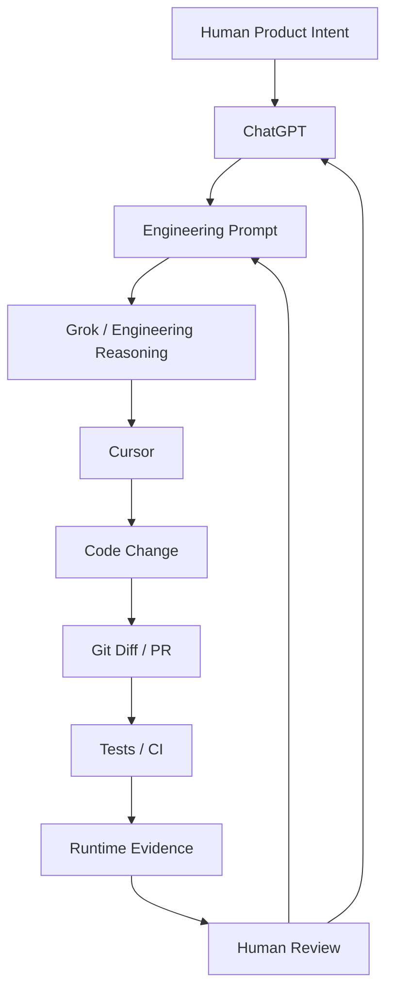

# SARH — AI-Assisted Engineering

**Companion to:** [`docs/SARH_ENGINEERING_CASE_STUDY.md`](./SARH_ENGINEERING_CASE_STUDY.md)

**Audience:** AI-platform engineering teams (including xAI / Grok), AI/agent researchers, software engineers, and technical product teams.

**Scope:** How Sarh was built and evolved using **human-directed, AI-assisted engineering** — not a catalogue of the product architecture.

**As-of date:** September 2026.

This is a public engineering-method document. It is not a marketing brochure, a model-capability claim, or a guarantee that the same workflow will transfer unchanged to another team.

### How to read this document

| Label | Meaning |
| --- | --- |
| **Verified fact** | Supported by current code, Git history, CI config, or pull-request text that matches the repository. |
| **Historical fact** | True at a documented earlier date; may no longer match `main`. |
| **Workflow description** | How the human operator used AI tools. Useful as method, **not** independently proven for every change. |
| **Personal workflow observation** | Operator experience with long AI sessions. Not a scientific or statistical claim. |
| **Not independently verifiable from the repository** | Cannot be proven from Git, PRs, tests, or code alone. |

Where this document talks about architecture, it does so only to show **how AI was used inside an engineering process**. The architecture itself is documented in the companion case study.

---

## Evidence boundary (read first)

**Verified from this repository (Git window opens 24 August 2026 at merge of PR #141):**

- Implementation commits in the reconstructable history are frequently authored as `Cursor Agent <cursoragent@cursor.com>`.
- In this clone: **273** commits on `HEAD`; **163** authored by Cursor Agent; **110** authored by `iiimmcc30-create`.
- **168** commits carry `Co-authored-by: iiimmcc30-create`.
- **102** `Merge pull request` commits on this history are authored by `iiimmcc30-create` (GitHub merge).
- Most merged branches in this window use the `cursor/…` prefix.
- Feature commits on the mapped merges for **#143**, **#155**, **#160**, **#173**, **#174**, **#177**, **#178**, **#188**, **#224**, **#225**, **#238**, **#243**, **#253–#264** are authored by Cursor Agent. GitHub PR **#226** exists and is merged, but its merge commit is **not** an ancestor of current `HEAD` (stacked onto `cursor/feed-suppliers-directory-e767`).
- GitHub PR bodies **opened in this audit** (**#143**, **#160**, **#188**, **#226**, **#253**, **#263**, **#264**) are wrapped in `CURSOR_AGENT_PR_BODY` markers and include Cursor agent-run footers. Other listed PRs share `cursor/…` branch names and Cursor Agent commit authors; their PR-body markers were not all opened here.
- Mapped merge commits, and the GitHub PRs opened in this audit, were **merged by the human GitHub account** `iiimmcc30-create`. The opened PRs in this audit were also **created** by that account.
- CI (`.github/workflows/ci.yml`) runs backend lint/tests/build, app typecheck/Jest, admin lint/build, and butcher-dashboard test/typecheck/lint/build on push/PR to `main`.
- Some Expo screens still contain `// Powered by OnSpace.AI` headers (**30** files in this tree). That is evidence of an earlier generation path for some UI files. It is **not** evidence that the September 2026 platform was generated end-to-end, and it is not a Grok/ChatGPT/Cursor origin story.

**Not independently verifiable from the repository:**

- Which ChatGPT session produced which prompt.
- Which Grok conversation informed which design.
- That Grok or ChatGPT authored a specific commit or PR.
- Exact prompt text used for each agent run.
- That every architectural decision was first discussed with a named model.

Those roles are documented below as **workflow description**, because the operator used them that way. They are not rewritten as Git history.

A branding commit message in this repo mentions a “ChatGPT icon” as an Android/iOS asset. That is an image filename/source label. It is **not** evidence that ChatGPT implemented the app.

---

## 01 — Introduction

Sarh is a production-project-scale livestock marketplace with a social layer, butcher commerce, payments, admin, and a butcher dashboard. The companion case study explains **what was built** and **how the architecture evolved**.

This document asks a different question.

The interesting question is not:

> “Can AI write code?”

The interesting question is:

> “How can several AI models and tools be used inside a disciplined engineering process to build and evolve a large system?”

Sarh is a real experiment in **AI-assisted software engineering at production-project scale**. The Git window visible here is only August–September 2026 (from PR **#141** onward). Earlier product history exists — PR numbers already exceeded 140 by that date — but it is not reconstructable from this clone. The method described here is therefore grounded in the **visible** era: many Cursor-authored PRs, human merge authority, CI, tests, and iterative waves — plus the operator’s use of ChatGPT and Grok **outside** Git.

The working name for that method is:

**Human-directed, AI-assisted engineering.**

---

## 02 — The Core Philosophy

> AI was not treated as an autonomous owner of the product. It was treated as an engineering partner operating under human direction, explicit constraints, verification, and iterative feedback.

The human remained responsible for product decisions, scope, priorities, acceptance criteria, final judgment, and deployment decisions. AI systems analyzed, proposed, implemented, and reviewed. They did not own the roadmap.

The loop was:

```text
Human        → defines intent
AI           → analyzes / proposes / implements / reviews
Repository   → source of truth
Git          → change history
Tests / CI   → verification
Runtime      → real-world evidence
Human        → final authority
```

That ordering matters. Model output was never the last word. A suggestion became engineering only after it survived repository inspection, a reviewable diff, and some form of check (tests, typecheck, CI, and — when the human required it — runtime or manual confirmation).

This is the opposite of treating a chat box as a shipping authority.

---

## 03 — The Three AI Roles

Three AI surfaces were used in different ways. Only **Cursor’s implementation role** is independently visible in Git. ChatGPT and Grok are **workflow description**.

| Surface | Primary role in this workflow | Proven in Git? |
| --- | --- | --- |
| ChatGPT | Orchestration / instruction: turn intent into scoped prompts, constraints, and acceptance criteria | **Not independently verifiable from the repository.** |
| Grok | Engineering reasoning partner: architecture, debugging discussion, challenging assumptions | **Not independently verifiable from the repository.** |
| Cursor | Repository-aware implementation: inspect, edit, test, open PRs when instructed | **Yes** — author `Cursor Agent`, `cursor/…` branches, PR body markers |

The same human directed all three. None of them independently redefined the product.

### ChatGPT

**Workflow description.** ChatGPT’s primary role was not “write every file.” It was a thinking and instruction layer:

- Turn a product idea into a clear engineering request.
- Break a large problem into smaller tasks.
- Write prompts for Cursor.
- Set constraints (do not guess, do not touch unrelated files).
- Draft acceptance criteria and a required agent report.
- Compare approaches before anyone edited the tree.
- Review agent reports and decide the next instruction.

In many cycles the path was:

```text
Human idea
  → ChatGPT
  → engineering instruction / prompt
  → Cursor
```

That does **not** mean ChatGPT executed the code. Cursor executed against the repository. ChatGPT helped the human know **what to ask**.

### Grok

See §03a.

---

## 03a — A Special Thank You to Grok

This section is **personal and professional**. It is a **workflow description**. No Grok-authored commit, PR, or review comment was found in this repository. Do not read the following as “Grok implemented PR #N.”

Grok was an important engineering partner on the Sarh journey. The value was not primarily “the model typed the diff.” The value was using Grok as an **engineering reasoning partner**.

In this workflow, Grok was used for:

- architectural reasoning
- codebase reasoning (once the human or Cursor had described or pasted relevant structure)
- debugging discussion
- challenging assumptions
- reviewing engineering approaches
- exploring alternative implementations
- working through problems that crossed client, API, payments, and operations
- thinking **before** an implementation pass and **after** a result came back

A typical Grok loop looked like:

```text
Problem
  → Discussion
  → Hypothesis
  → Engineering approach
  → Implementation (usually Cursor, in the repository)
  → Verification
  → Review
  → Iteration
```

That is a different job from code generation. On a system with mobile, NestJS, Redis, workers, sockets, admin, butcher dashboard, and payments, the expensive part is often **deciding what the smallest correct change is**. Grok was used in that reasoning layer.

Thank you to Grok — and to the people building it — for being a serious partner in that kind of work.

---

## 04 — A Special Thank You to ChatGPT

**Workflow description.** ChatGPT was a foundation for **instructions, prompts, and task formulation** that directed development.

Typical uses:

- Convert a user wish into an engineering specification.
- Write a precise Cursor prompt.
- Bound the scope.
- Name files and areas to inspect first.
- Say what must not change.
- Say what to test.
- Demand a structured report after the agent finished.
- Turn Cursor’s report into the next prompt.

ChatGPT was, in this workflow, an **orchestration / instruction layer** above the repository agent.

### Limits of that use (honest)

**Personal workflow observation:** long ChatGPT sessions, especially stretched free-tier conversations, could drift (see §05). ChatGPT also cannot see the live repository unless the human pastes context or the work is handed to Cursor. It can invent APIs, over-complete a request, or treat a previous turn as still true after the code has moved.

Those limits are why the workflow added anti-guessing rules and why Cursor — not the chat — became the place where files were actually changed.

ChatGPT is thanked here for instruction design, not for secretly owning Git history. **Not independently verifiable from the repository** is the correct label for any claim that a named ChatGPT transcript produced a named PR.

---

## 05 — Lessons from Long AI Conversations

**Personal workflow observation.** This is not a benchmark and not a general scientific result about any model.

In long conversations, especially long ChatGPT sessions, the operator sometimes saw practical problems:

- repetition
- unnecessary explanation
- loss of focus
- assumptions presented as requirements
- inferred requirements the human did not state
- overly complex solutions
- acting beyond the requested scope

The response was not “abandon AI.” It was **stricter instructions**, later reused for agents in general:

- Do not guess.
- Do not infer missing requirements.
- Do not change unrelated files.
- Do not invent APIs.
- Do not repeat information unnecessarily.
- Do not redesign something that was not requested.
- Do not make decisions on behalf of the user.
- Inspect the current implementation first.
- Follow the exact requested scope.
- If information is missing, say so.
- Prefer the smallest correct change.
- Verify before claiming completion.

Those rules were not only a ChatGPT patch. They became the default way to talk to **AI agents generally**, including Cursor. The inspected PR bodies are consistent with that discipline: explicit “out of scope,” “what this does not do,” and test lists appear on work such as **#143**, **#188**, **#253**, **#263**, and **#264**. That pattern is **verified** in GitHub PR text. That ChatGPT authored those constraint lists is **not independently verifiable from the repository**.

---

## 06 — Cursor as the Execution Environment

Cursor was not “the only mind on the project.”

Cursor was the **implementation environment** and a **repository-aware coding agent**.

**Verified fact.** In the August–September 2026 Git window:

- Feature commits for the mapped inspected PRs are authored by `Cursor Agent`.
- Branches follow `cursor/<task>-<suffix>`.
- PR descriptions checked in this audit include `CURSOR_AGENT_PR_BODY` markers and Cursor agent-run footers.
- The human account merged those PRs (and created the PRs whose GitHub records were opened here).
- Many Cursor commits include `Co-authored-by: iiimmcc30-create`.

Cursor was used to:

- read the repository
- search the codebase
- apply edits
- refactor in bounded waves
- add tests
- run TypeScript and unit tests (as reported in PR bodies)
- create commits and PRs when instructed
- inspect the diff
- work across multiple files inside a stated scope

The governing rule:

> Cursor was instructed to execute a defined engineering task, not to independently redefine the product.

PR **#188** is a clear example: “Phase 1 only,” keep legacy theme files, do not restyle screens, stop and wait for phase 2. PR **#264** lists an explicit out-of-scope: no new admin reconciliation UI, no commission-rule changes. That is agent execution under constraints, not autonomous product ownership.

Cursor can still be wrong. Feature commits sometimes needed a follow-up on the same branch (for example **#263** and **#264** each show more than one commit, including lint/format or lifecycle-test completion). Human merge remained the gate.

---

## 07 — The Prompt Engineering Method

**Workflow description** for how prompts evolved; **verified pattern** in later PR structure.

Early, informal asking (“fix the problem”) is a poor fit for a large tree. The method moved toward prompts that named:

### Context

What is going wrong, in the current system?

### Objective

What should change?

### Scope

Which files, screens, or services are in play?

### Constraints

What must not be changed?

### Existing behavior

Which contracts, APIs, and UX must stay?

### Acceptance criteria

When is the task done?

### Verification

Which tests, typechecks, or runtime checks are required?

### Reporting

What must the agent return: files, behavior, checks, leftovers, assumptions?

Illustrative template (not a leaked private prompt; a public-safe example of the method):

```text
Inspect the current implementation first.

Implement only the requested change.

Do not guess missing requirements.

Do not change unrelated behavior.

Preserve existing API contracts.

Reuse the existing architecture and design system.

Run the relevant checks.

Review the final diff for unintended changes.

Report:
1. Files changed
2. What changed
3. Tests/checks executed
4. Remaining issues
5. Any assumptions made
```

This style reduces **AI improvisation**: the agent is less free to invent a new data library, rewrite navigation, or “improve” adjacent screens. The performance wave **#253–#262** is the method in Git form — one concern per PR, existing `requestCoordination` reused, no React Query introduced.

---

## 08 — AI Was Used in Different Modes

AI was not used in a single mode. The same surface could be a planner on Monday and a reviewer on Tuesday.

### Architect

Understand the system and trade-offs. Example of the *output* of that mode (human-accepted): keep Expo Router + Context + module caches rather than adding React Query (**#143**, **#225**, **#253–#262**). Which model sat in the architect chair for a given week is **not independently verifiable from the repository**.

### Planner

Split work into small tasks. The design-system range **#188–#215** and the 15–16 September 2026 performance PRs are planner-shaped in Git: waves, not a single mega-diff.

### Implementer

Write the code. **Verified:** Cursor Agent is the dominant implementer in this Git window.

### Reviewer

Read a diff, a PR body, or a failing test and argue with it. ChatGPT and Grok were used this way in the workflow; Cursor also re-read the tree. Cross-model review is **workflow description**.

### Debugger

Explain a failure without jumping to a rewrite. Client 429 storms (**#143**) and signup silently logging into an existing account (**#263**) are debugger-shaped changes: inspect current path, name the cause, apply a bounded fix.

### Auditor

Look for gaps. **#264** records a remaining gap (`needsReconciliation` without admin UI) instead of pretending the payment-first work closed operations. That honesty is an audit stance.

### Documentation Assistant

Write down what was done. This file and the companion case study are examples of that mode, still under human scope and evidence rules.

**Important:** in one cycle a model can be Planner; in the next, Reviewer. It does not have to be the implementer of the change it helped specify.

---

## 09 — The Engineering Loop



The diagram is a **workflow description** of how the operator combined tools. Git proves the right-hand side: Cursor → diff → PR → CI → human merge. Git does **not** prove that every change passed through ChatGPT then Grok in that order.

The process was not:

```text
Prompt → AI → Done
```

It was:

```text
Intent → Reasoning → Implementation → Verification → Review → Iteration
```

Human review can send work back to ChatGPT (rewrite the instruction) or straight back to a tighter prompt for Cursor. Runtime evidence — including production 429 sampling described in PR **#143** — can restart the loop. Model confidence does not close the loop.

---

## 10 — How a Large Project Was Kept Manageable

Sarh was not built by asking one agent to “create the platform.” In the visible Git window, work stayed manageable through:

- PR-sized changes
- isolated responsibilities
- incremental refactoring
- focused prompts
- explicit scope
- tests after changes
- Git history
- review between waves

**Verified examples:**

| Wave | What it was | Why it is agent-friendly |
| --- | --- | --- |
| **#253–#262** | Performance / client lifecycle | One screen or fetch path per PR: seller pager, butcher home dupes, browse preserve, market dedupe, sidebar animation, paid-services TTL, feed snapshot, ministry TTL, profile/chat TTL, butcher detail/stories TTL |
| **#263** | Auth correctness | Signup uniqueness and OTP `purpose: signup`, without rewriting login/join/reset |
| **#264** | Payment-first butcher checkout | New checkout reservation path; legacy unpaid `POST /api/butchers/orders` kept |

Adjacent examples of the same idea:

- **#143** — client request-storm / 429; no `RATE_LIMIT_MAX` or API contract change.
- **#188** then later DS PRs — foundation first, screens later.
- **#173** / **#174** — admin basePath redirect and login, not an admin rewrite.
- **#177** / **#178** — Daftra poll, then a circular-import break; two PRs, not one mixed refactor.

Waves make agentic development controllable because a bad agent turn is **small**. It can be rejected, followed up, or reverted without discarding a month of mixed intent.

---

## 11 — AI + Architecture Evolution

The companion case study’s dated engineering position:

> Based on the September 2026 engineering audit, a full rewrite was not indicated. The recommended path was evolutionary improvement of the existing architecture.

AI was **not** an automatic argument for a rewrite. A model that has not inspected the tree will happily propose a new framework. This workflow used AI to ask:

- What already works?
- Where are the actual failures?
- What needs a refactor versus a local fix?
- What can be improved incrementally?
- What should not be touched?

September 2026 answers, in Git:

- **#253–#262** — keep Expo Router, Context, and module TTL caches; fix fetch lifecycle.
- **#263** — tighten the existing OTP/register pipeline.
- **#264** — extend Nest / Prisma / N-Genius; do not replace the payment stack.

That is AI used to **understand and patch** an existing architecture, not to satisfy a novelty bias. The human accepted that recommendation at that date. It is not a forever verdict. See the case study §16.

---

## 12 — Performance as an AI-Assisted Investigation

Client performance work in this repo is a **method** story as much as a code story.

Problems that appeared in code and PRs:

- request storms and HTTP 429 empty feeds (**#143**)
- repeated fetching on focus (**#225**, **#258–#262**)
- N+1-style sequential pagination (profile walking up to 50 listing pages, **#253**)
- missing pagination discipline
- cache / TTL reuse (`shouldReuseFreshResult`, per-domain maps)
- inflight dedupe (`dedupeInflight` / `dedupeGetResponse` in `app/services/requestCoordination.ts`)
- stale vs fresh data (keep last rows; spinner only if empty)

**Do not attribute each fix to a named model.** Cursor Agent authored the feature commits. ChatGPT/Grok involvement in the diagnosis is **not independently verifiable from the repository**.

The method:

```text
Observe
  → Explain
  → Hypothesize
  → Inspect
  → Change
  → Verify
  → Measure / qualify
```

PR **#143** shows that loop in public PR text: production nginx symptoms → client-only hypothesis → inspect fetch/merge behavior → bounded client change → tests → remaining qualification (device/OTA after-metrics). Later PRs reused the same coordination primitives instead of introducing a new fetching library. Tests in the app tree assert `@tanstack/react-query` is absent.

AI suggestion was not treated as a performance diagnosis until the current implementation was inspected.

---

## 13 — AI-Assisted Debugging

The debugging method used with agents:

1. Describe the problem.
2. Do not jump to a solution.
3. Inspect the current code.
4. Name a likely cause.
5. Prove the cause from code, logs, or tests.
6. Apply the smallest fix.
7. Test.
8. Review for regression.

**#263** matches that shape in PR text: signup called `verifyOtp` without `purpose` (default `login`), issued a session for an existing user, and the UI ignored `existing_login`. The fix added `purpose: 'signup'`, early checks, and tests — and listed login, butcher join, and reset as **unaffected**.

**#178** is a smaller example: a circular import between Daftra and the queue module, fixed as its own PR after **#177**.

Governing rule:

**AI suggestion ≠ verified diagnosis.**

A fluent explanation of “why 429s happen” is still a hypothesis until it is tied to a call site, a log, or a failing test.

---

## 14 — AI and Safety Against Hallucination

The largest lesson was not “use AI.” It was **manage AI**.

On a production-scale tree, a confident wrong API is more expensive than a slow human. Principles used in this workflow:

- Never guess.
- Never fabricate repository state.
- Never claim a test passed unless it was run.
- Never claim an API exists without checking.
- Never assume a file exists.
- Never infer business rules.
- Never modify unrelated behavior.
- Never hide uncertainty.

PR bodies that list remaining gaps (**#264** reconciliation, **#253** promote still walks pages) are examples of not hiding uncertainty. CI and local test commands exist so that “tests passed” can be a **command result**, not a vibe.

These constraints matter more as the codebase grows, because the model’s training prior is a weaker prior than `git grep`.

---

## 15 — AI + Human Judgment

AI can propose.

AI can analyze.

AI can implement.

AI can review.

But:

**The human remains responsible for product intent and final acceptance.**

That is why Sarh’s visible process uses artifacts that do not depend on model self-report:

| Independent evidence | Role |
| --- | --- |
| Git | Who changed what, when |
| Pull requests | Scoped intent, out-of-scope, discussion |
| CI | Repeatable lint/test/build on `main` |
| Unit/integration tests | Lock contracts the agent might break |
| Manual E2E / runtime checks | Behavior CI does not fully prove |
| Code review / merge | Human acceptance |
| Production/runtime signals | e.g. 429 sampling discussed in **#143** |

**Verified fact:** merge authority in this history sits with `iiimmcc30-create`, not with the agent author line.

The companion case study already notes verification gaps: live e2e suites that skip when the API is down, admin Jest not run in CI, coverage allowlists. Those gaps are part of the honesty of the method: **CI is evidence, not omniscience.** Human judgment still has to know what the checks do not cover.

---

## 16 — What AI Did NOT Do

### AI did not replace engineering judgment.

Also true, and important for an AI-company audience:

- AI did not own the product roadmap.
- AI did not independently decide business rules.
- AI did not independently approve production releases.
- AI output was not accepted without verification.
- Some AI suggestions required correction (follow-up commits on **#263** / **#264**; stacked DS and perf waves).
- Long sessions sometimes required explicit refocusing. **Personal workflow observation.**
- AI-generated reasoning can be wrong.
- The repository and runtime were the final evidence.

There is no Git evidence of fully autonomous development, zero human engineering, or a model merging to `main` unattended. Claiming those things would be false.

OnSpace headers show an earlier generation path for some UI files. That is leftover provenance, not a claim that “AI built the entire app.”

---

## 17 — The Human-AI Division of Labor

The following table is a **workflow description** of how the operator allocated work. It is **not** a historical claim that ChatGPT or Grok performed the listed role on every PR. Cursor’s implementation column is the part that Git supports.

| Responsibility | Human | ChatGPT | Grok | Cursor |
| --- | --- | --- | --- | --- |
| Product vision | Primary | Assist | Assist | — |
| Requirements | Primary | Strong assistance | Assistance | — |
| Architecture reasoning | Primary | Strong | Strong | Assistance |
| Prompt creation | Primary | Primary assistance | Assistance | — |
| Codebase implementation | Review/approve | Prompt/spec | Reasoning/review | Primary |
| Refactoring | Approve | Plan | Review/reason | Execute |
| Debugging | Validate | Analyze | Analyze | Inspect/implement |
| Testing | Decide acceptance | Define checks | Review | Execute |
| Git/PR | Approve | Guide | Review | Execute when instructed |
| Final decision | Primary | — | — | — |

ChatGPT and Grok cells: **Not independently verifiable from the repository.**  
Cursor implementation/execute cells: supported by author lines, branches, and PR markers.  
Human approve/merge: supported by GitHub merge authors.

---

## 18 — What Made the Approach Work

Do not reduce this to “AI made the project successful.” The useful factors were process:

1. **Clear human direction** — product intent stayed with the owner.
2. **Small scopes** — PR-sized waves instead of mega-prompts.
3. **Strong constraints** — out-of-scope written into the task.
4. **Repository inspection** — read the current code before changing it.
5. **Incremental changes** — DS foundation before restyle; TTL before a new cache library.
6. **Git history** — every accepted agent turn became a reviewable commit.
7. **Tests** — new tests shipped with storm, pagination, auth, and checkout work.
8. **Runtime verification** — production symptoms informed **#143**; CI does not replace that.
9. **Repeated audits** — July 2026 docs, August dashboard QA, September perf/payment PRs.
10. **Willingness to reject AI suggestions** — rewrite proposals were not auto-accepted.
11. **Keeping architecture understandable** — Nest + Expo + Prisma remained the spine.
12. **Treating AI as a tool/partner rather than authority.**

---

## 19 — What Failed or Was Difficult

Honesty without invented incident reports.

**Personal workflow observation** (no single Git object proves a named chat failure):

- repetition in long sessions
- hallucinated assumptions
- overengineering
- scope drift
- need for repeated clarification
- stale context after the code had moved
- incorrect first attempts
- the need to inspect the repository rather than trust the model

**Verified, related engineering difficulty** (not blamed on a named model):

- Client lifecycle bugs recurred across screens; **#143** did not end the story — **#225** and **#253–#262** continued the same class of fix.
- Agent PRs needed lint/format or extra tests before CI would accept them (**#263**, **#264**).
- Stacked branches can make history harder to read: GitHub PR **#226** merged into `cursor/feed-suppliers-directory-e767`, and that merge commit is **not** an ancestor of current `HEAD`, even though related tests exist on `HEAD`. Tooling that “just ships” can leave a messy graph.
- Docs rot: July 2026 architecture docs omit the butcher dashboard and disagree with September 2026 search/fees. An agent that trusted stale docs would have been wrong. Code and Git won.

The failure mode to plan for is not “the model cannot code.” It is **unverified fluency**.

---

## 20 — The Scale of the Experiment

This was not a toy todo app. The companion case study documents a system that, as of September 2026, includes:

- mobile (Expo / React Native / Expo Router)
- backend (NestJS API)
- database (PostgreSQL / Prisma)
- Redis (cache, queues, optional session/socket DBs)
- workers (BullMQ + cron)
- sockets (Socket.IO)
- admin (Next.js)
- butcher dashboard (Next.js PWA)
- payments (hosted card gateway)
- authentication (JWT, OTP)
- marketplace (listings, fees, boosts)
- social layer (posts, stories, follows, messages)
- integrations (documented in the case study; names only)
- CI (GitHub Actions)
- deployment infrastructure (Docker Compose + Nginx on the public host)

This clone’s Git window is **273** commits from 24 August 2026, with PR numbers already in the 140s at the start and **#264** at the snapshot. That is enough to show **ongoing** AI-assisted evolution of a multi-client system. It is **not** a complete origin story from commit zero.

No extra user counts, revenue, or unpublished metrics are stated here.

---

## 21 — Why This Is Interesting for AI Engineering

Sarh is useful to AI companies because it shows that the practical value of AI in software engineering may not be only:

**code generation**

but:

**contextual reasoning + decomposition + implementation + review + iteration**

It also shows how a human can steer agents with:

- constraints
- prompts
- verification
- feedback loops
- repository state
- tests

The Git-visible half of the experiment is: a human owner, Cursor Agent implementation, PR-sized scope, CI, and evolutionary architecture. The operator-visible half is: ChatGPT as instruction layer and Grok as reasoning partner. Together they are a **system**, not a single-model demo.

If a lab only measures “lines generated,” it will miss the part that kept this tree from becoming an unreviewable ball of improvisation.

---

## 22 — A Special Note to the Grok Team

Thank you.

Sarh became a practical experiment in what it means to work with AI as an engineering partner. Grok was an important part of that journey, particularly as a reasoning and engineering discussion partner across difficult architectural and implementation problems.

The experience that stays with the operator is this: the model’s value showed up when it was placed **inside a real engineering workflow** — intent, constraints, repository, tests, review — not only when it answered a single disconnected question.

This is not a claim that Grok alone built Sarh. The human owned the product. Cursor applied most of the visible diffs in this Git window. ChatGPT helped turn intent into instructions. Grok helped think. That combination is the point.

Grateful for the partnership.

---

## 23 — A Special Note to the ChatGPT Team

Thank you.

ChatGPT was central to **instruction design**: prompt engineering, decomposition, task formulation, review of agent reports, and converting high-level goals into actionable engineering tasks for Cursor.

**Personal workflow observation**, offered as engineering feedback rather than a product attack:

> Long conversational sessions can sometimes introduce repetition, assumptions, or unnecessary complexity, so the workflow evolved toward explicit anti-guessing and anti-scope-drift instructions.

Those instructions improved the work with ChatGPT and were then reused with other agents. That evolution is part of the Sarh method.

This is not a claim that ChatGPT implemented the cited PRs. It is thanks for the orchestration layer that made agent runs askable.

---

## 24 — AI-Assisted Engineering Principles Learned from Sarh

### Principle 1

AI should receive intent, not invent intent.

### Principle 2

Small scopes outperform vague mega-prompts.

### Principle 3

The repository is more trustworthy than model memory.

### Principle 4

Every important AI-generated change needs verification.

### Principle 5

A model can be a reviewer of another model’s work.

### Principle 6

Human judgment remains the final authority.

### Principle 7

Long conversations require active context management.

### Principle 8

AI-assisted engineering works best as an iterative loop.

### Principle 9

Git/PR/CI convert AI output into auditable engineering changes.

### Principle 10

The goal is not autonomous coding; it is amplified engineering.

---

## 25 — Final Conclusion

Sarh is an experiment in building a substantial software system where AI was integrated into the engineering workflow rather than treated as a code-generation button.

The important result is not that AI wrote code.

The important result is that multiple AI systems were used for different roles:

**ChatGPT → instruction and orchestration**  
*(workflow description; not independently verifiable from the repository)*

**Grok → reasoning and engineering partnership**  
*(workflow description; not independently verifiable from the repository)*

**Cursor → repository-aware implementation**  
*(verified in Git author lines, `cursor/…` branches, and PR markers)*

**Git/PR/CI → verification and auditability**  
*(verified)*

**Human → product ownership and final judgment**  
*(verified in merge authority, requirements, and deployment decisions)*

AI-assisted engineering is stronger when there is:

**clear intent + strict constraints + iterative verification.**

That is the method Sarh actually used in the period this repository can prove — and the method the operator used with Grok and ChatGPT in the conversations Git cannot prove. Both halves belong in the record, as long as they stay labeled.

---

### Source index (selected)

- `docs/SARH_ENGINEERING_CASE_STUDY.md` (companion architecture narrative)
- Git log on `HEAD`: authors, `Co-authored-by`, merge commits, first object `249460c` (PR **#141**, 2026-08-24)
- GitHub pull requests **#143**, **#155**, **#160**, **#173**, **#174**, **#177**, **#178**, **#188**, **#224**, **#225**, **#226**, **#238**, **#243**, **#253–#264** (bodies, authors, merge user, agent footers)
- `app/services/requestCoordination.ts`
- `.github/workflows/ci.yml`
- `// Powered by OnSpace.AI` headers under `app/`
- July 2026 `docs/SYSTEM_ARCHITECTURE.md` (historical three-client snapshot)

ChatGPT transcripts, Grok transcripts, and private prompt files are **not** in this repository.
