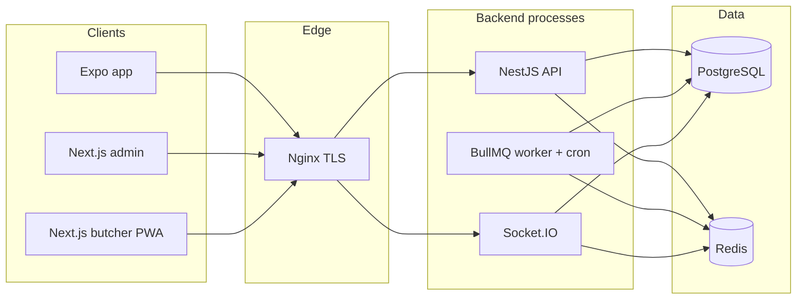
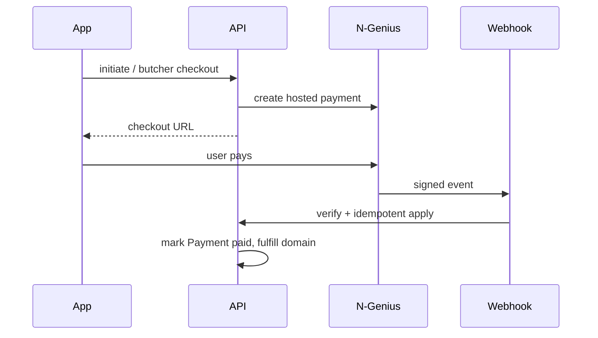
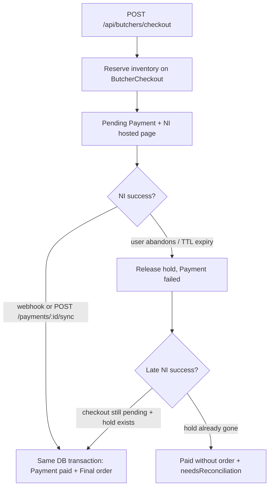
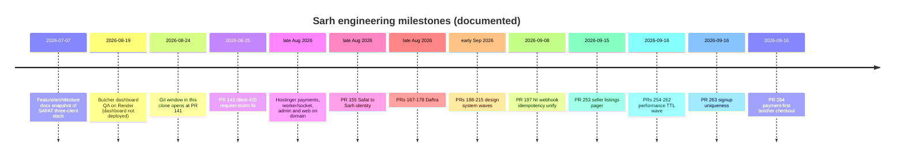

# SARH — Engineering Case Study

**Audience:** engineers, technical product teams, AI/software-engineering reviewers, and technical investors.

**Scope:** How Sarh was built and how it evolved, using the repository, Git history, pull requests, tests, and internal documentation as sources.

**As-of date:** September 2026.

This is a public engineering narrative. It is not a marketing brochure, a security review, or a guarantee about future architecture.

### How to read this document

| Label | Meaning |
| --- | --- |
| **Verified fact** | Supported by current code, Git history, CI config, or pull-request text that matches the code. |
| **Historical fact** | True at a documented earlier date; may no longer match production or `main`. |
| **Engineering observation** | Conclusion from audits, code review, or PR investigation. |
| **Recommendation** | Advice given at a specific time; not a promise. |
| **Known gap** | Incomplete, stubbed, or unverified work. |

Where July 2026 documentation disagrees with September 2026 code, **trust the code** and treat the older docs as a historical snapshot.

---

## 01 — Product

**Verified fact.** Sarh (سرح) is a Saudi livestock marketplace with a social layer and a butcher (ملحمة) commerce layer. The mobile package name is `com.sarh.app`. The Expo app package is still named `safat`; backend logs historically used the service name `sarouh-api`. Those names are leftovers from earlier branding, not separate products.

### What the product is

Sarh lets people:

- Publish and browse **livestock and equipment listings**.
- Run a **social feed** (posts, stories, follows, direct messages).
- Discover **butcher shops**, browse products and offers, place meat orders, and track fulfillment.
- Pay for **subscriptions**, **listing fees**, and **paid listing boosts** (feature / pin / promote) through a hosted card gateway.
- Read **Ministry of Environment, Water and Agriculture (MEWA)** official-account content and **ministry-published services**.
- Open **in-app support** (tickets, with an assistant named Sarhan).
- Host or watch **live streams** (Agora RTC).

Four clients exist in the repository:

| Client | Path | Stack |
| --- | --- | --- |
| Mobile / Expo web | `app/` | Expo Router, React Native |
| Admin panel | `admin-panel/` | Next.js 14 |
| Butcher dashboard | `butcher-dashboard/` | Next.js 14 PWA |
| API / worker / socket | `backend-nest/` | NestJS, Prisma, Socket.IO, BullMQ |

The butcher dashboard README states it is **not** a POS, **not** a cashier, **not** the platform admin, and **not** the mobile app. No POS or cashier module exists in the codebase.

### What the product is not

Sarh is **not** a veterinary-services platform. It does not operate clinics, book veterinarian visits as a first-party medical product, or store clinical records.

The app **does** surface MEWA-authored services, some of which are categorized as veterinary (for example a ministry clinic-appointment service and livestock vaccination booking). Those entries are official-content records (`OfficialServicesModule` + `/ministry`), not Sarh-operated veterinary workflows.

A leftover welcome string still describes the app as a livestock and veterinary-services platform. That copy does not match the implemented domain. Treat it as stale marketing text, not architecture.

---

## 02 — The Beginning

**Historical fact — limits of this Git clone.**

This working tree’s Git history **does not start at commit zero of the original product**. The oldest commit in this repository is:

- `249460c` — 24 August 2026 — `Merge pull request #141`

Pull request numbers already exceeded 140 by that date, so substantial work happened before this clone’s first object. That earlier history is not reconstructable from `git log` here. This document therefore does **not** claim a founding date, a first file, or an original authoring tool as a complete origin story.

What *can* be proven:

1. **July 2026 documentation snapshot.** `docs/SYSTEM_ARCHITECTURE.md` and `docs/FEATURE_INDEX.md` were last audited **2026-07-07**. They describe a platform then called SAFAT in docs, with three clients (Expo app, Next.js admin, NestJS API) and three backend processes (HTTP, Socket.IO, workers). The butcher dashboard is **absent** from that architecture diagram.
2. **Code comments.** Several screens still carry `// Powered by OnSpace.AI` headers. That is evidence of an earlier generation path for some UI files. It is **not** evidence that the entire platform was generated, and it is not a product origin date.
3. **Naming drift.** Package and logger names (`safat`, `sarouh`) predate the public Sarh identity (`com.sarh.app`, `sarhsa.online`). PR **#155** (late August 2026) updated Android/iOS identity from Safat to Sarh.
4. **August 2026 operations.** A butcher-dashboard QA note dated **19 August 2026** tested a Render-hosted API. Root `README.md` later states that **Hostinger is current production** and Render/Railway must not be treated as current production.

**Engineering observation.** By July 2026 the product was already a monolith API plus mobile and admin clients, with marketplace, social, butcher orders, payments, Redis, and BullMQ in place. From August 2026 onward the Git history in this repo shows **evolutionary** change: production hardening, a fourth client (butcher dashboard), Hostinger deployment, Daftra, a design system, then performance and payment-lifecycle work.

### How responsibilities separated (as of the documented era)

```text
Mobile (Expo)     → customer + butcher-owner UX, listings, feed, checkout UI
Admin (Next.js)   → staff moderation, CMS, ministry content, settings
Butcher dashboard → shop operations (orders, catalog, inventory, reports)
                    added after the July 2026 three-client snapshot
Backend           → auth, domain rules, payments, sockets, queues
```

The NestJS process split (API / worker / socket) is already described in the July 2026 architecture doc and is still how production compose is organized in September 2026.

---

## 03 — Architecture Evolution

### High-level shape (September 2026)



**Verified fact.** Production compose (`docker-compose.prod.yml`) runs `postgres`, `redis`, `api`, `worker`, `socket`, `admin`, `butcher`, and `nginx`. API and socket are bound to localhost on the host and reached through Nginx.

### Mobile

| Change | Why | Problem addressed |
| --- | --- | --- |
| Expo / React Native / Expo Router | Client stack in `app/package.json` | Single codebase for iOS, Android, and Expo web |
| `expo-dev-client` + EAS profiles | `eas.json` development / preview / production | Native modules (Agora, maps) are not Expo Go apps |
| Identity rename Safat → Sarh | PR **#155** | Store and Firebase config aligned to `com.sarh.app` |
| Host Expo web on the public site | PR **#154** | Web surface on the same domain as API |
| Design-system foundation then v2 | PRs **#188–#215** | Stop one-off colors/typography; migrate screens incrementally |
| Client request coordination | PR **#143**, later **#225**, **#249**, **#253–#262** | 429s, duplicate GETs, focus storms |

There is **no** Redux and **no** React Query. Tests assert `@tanstack/react-query` is absent. State is React Context plus module-level caches.

### Backend

| Change | Why | Problem addressed |
| --- | --- | --- |
| NestJS + Prisma + PostgreSQL | July 2026 architecture; still current | Typed HTTP API and relational persistence |
| Redis logical DBs 0–3 | Documented and still used | Separate cache, BullMQ, sessions, socket adapter |
| Dedicated worker process | Compose `SERVICE_MODE=worker`; PR **#150** heartbeat | Queues/cron must not die with HTTP |
| Dedicated socket process | Compose `SERVICE_MODE=socket`; PRs **#151**, **#152** | Realtime isolation; Nginx must reach the socket network |
| Hostinger Docker + Nginx | README; PRs **#141+** | Move off Render cold-start hosting (historical) |
| Cloudinary as production storage | env template + upload code | Object storage without shipping binaries in Git |
| Unified search API | Current `SearchController` | July docs only had trending; code now has `GET /api/search` + suggest |

### Platforms

- **Admin** gained a production path `/admin` (PR **#153**) after cookie/base-path issues caused login bounce.
- **Butcher dashboard** was incomplete on Render in the 19 August 2026 QA note (historical). By September 2026 it is a compose service behind Nginx `/butcher`.

### Integrations (evolution, not a dump)

Payments (N-Genius), OTP (Twilio), Google sign-in, FCM (Firebase Admin), Agora tokens, Cloudinary, optional Sentry, optional OpenAI for support, and per-butcher Daftra accounting were added as **domain needs**, not as a platform rewrite. Daftra landed in Git in late August 2026 (PRs **#167–#178**). Webhook handling was unified in PR **#197**.

---

## 04 — Mobile Engineering

**Verified fact.** The app is Expo Router. Root layout enables `react-native-screens` freeze, bootstraps theme and RTL, and gates navigation with auth + onboarding (`resolveBootNavigation`).

### Navigation and lifecycle

- Stack screens hide native headers; chrome is custom (`ScreenHeader`, design-system back button).
- `useFocusEffect` is used widely. That is the correct React Navigation pattern, and it is also the mechanism that **re-fetched on every return visit** until the September 2026 TTL work.
- Rapid navigation is partially mitigated by freeze-on-blur and by invalidating in-flight work with generation tokens (`createRequestGeneration`) and `dispose()` on pagers.

### Network, cache, TTL, deduplication

Shared helpers live in `app/services/requestCoordination.ts`:

- `dedupeInflight` — one Promise per key.
- `dedupeGetResponse` — materializes JSON via UTF-8 **text** (not ArrayBuffer). PR **#148** fixed Arabic Mojibake caused by latin1 decoding in the RN fetch polyfill.
- `shouldReuseFreshResult` — TTL gate.
- 429 backoff shared across feed callers.

Typical **network freshness** is 60 seconds. The **disk feed snapshot** (`sarouh:feed_snapshot_v2`) may be shown for up to **six hours**, which is a hydration TTL, not a “fresh enough to skip network” TTL. PR **#259** made that distinction explicit.

### Pagination

List APIs use cursors. Seller profiles used to walk up to 50 listing pages on open. PR **#253** switched profile/user screens to a demand-driven pager. The Promote picker still walks seller pages on purpose (it needs the full set of boostable ads).

### Loading and stale data

The earlier pattern was: any refetch sets `loading=true`, which unmounts the list and shows a spinner. Market Browse (PR **#255**) and several later screens keep last-good rows, show a full-screen spinner only when empty, and ignore stale generations.

### State management

| Concern | Implementation |
| --- | --- |
| Session | `AuthContext` + AsyncStorage; `authFetch` refreshes on 401 |
| Feed / listings / me | `AppContext` |
| Plans | `SubscriptionContext` |
| Theme | `ThemeContext` synced into design-system `colors` |
| Caches | Module-level Maps/objects keyed by resource |

### Offline

**Known gap.** The mobile app is **not** an offline-capable client. Module caches and the feed snapshot improve repeat visits and cold start; they do not queue writes or serve a guaranteed offline mode.

The butcher **dashboard** registers a PWA `offline.html` shell. Tests state that shell is not live dashboard data.

### RTL and performance decisions

RTL is a first-class policy (`app/lib/rtl.ts`): `I18nManager` + `dir` on web. Design-system `AppText` owns typography. Performance work preferred **request discipline** over introducing React Query.

---

## 05 — Marketplace Architecture

### Listings (seller marketplace)

- **Client** renders feeds, detail, create/edit, comments, favorites where implemented, and promote UI.
- **API** (`ListingsModule`) owns persistence, visibility, featured/pinned flags, and listing-fee creation.
- **Database** `Listing` (+ comments, fees, offers as modeled).
- **Workers** enqueue overdue listing-fee checks.
- **Payments** fulfill listing-fee checkouts via N-Genius webhooks/sync.

Paid listing services (feature / pin / promote) are gated by server flags (`GET` paid-services settings). Display prices on the client are previews; **the server is authoritative** for the charged amount (promote catalog SSOT, PR **#217**).

### Butchers, products, cart, orders

```text
Customer app
  → catalog GETs (list embeds offers; detail embeds products/reviews)
  → checkout or legacy create-order
  → N-Genius hosted page
  → webhook / payment sync
  → ButcherOrder + inventory + timeline
  → Socket.IO to customer, butcher, admin
```

Inventory uses `availableQuantity` and `reservedQuantity`. Status changes go through `OrderLifecycleService` only, with `SELECT … FOR UPDATE` and an explicit state machine. Illegal transitions return 409.

**Historical vs current checkout:**

| Era | Sequence |
| --- | --- |
| **Historical (still present)** | `POST /api/butchers/orders` can create an order, then pay later |
| **September 2026 payment-first (PR #264)** | `POST /api/butchers/checkout` holds stock on a `ButcherCheckout`; a final order is created only after payment is confirmed |

Admin order UI is documented as **read-only** for status (staff monitor; butchers advance the pipeline).

### Commissions (public-safe)

Two **independent** backend paths exist:

1. **Listing commission** — a `ListingFee` owed on listing/sale amounts.
2. **Butcher order commission** — a ledger entry on completed (delivered) orders.

Plan permission `storeCommission` can exempt a butcher. Numeric rates are **not** published here. The client must not be treated as the source of truth for fee math.

### Customers and reports

Butcher dashboard pages exist for customers and reports. Definitions of “sale” historically differed between stats and reports (August 2026 QA note). Treat that as a known consistency risk unless a later unification is proven; this case study does not claim they were unified.

---

## 06 — Payments & Financial Flows

**Verified fact.** Card data is not processed inside Sarh. The API creates a pending `Payment`, N-Genius hosts checkout, and Sarh fulfills on webhook or authenticated `POST /api/payments/:id/sync`.

### Initiation

`POST /api/payments/initiate` (JWT, payment rate limit) supports subscription, listing-fee, boost/promotion, and butcher checkout contexts. Existing pending payments for the same reference can be reused (idempotent checkout creation is implemented for NI orders).

### Progression and completion



**PR #197** routed the legacy webhook through `NiWebhookService.handleRaw`, storing integration webhook events so duplicate deliveries do not re-apply side effects.

**PR #264** added butcher checkout fulfillment in the same database transaction as `Payment → paid`. If stock was already released (abandon/expiry) and N-Genius later reports success, the payment may be marked paid **without** creating an order, with reconciliation flags (`capturedAfterCancel`, `needsReconciliation`). `POST /sync` returns **database** status, not NI success alone.

### Refunds

**Verified fact (docs + code path).** Refunds are driven by gateway webhook events. There is **no** in-app or admin “issue refund” UI. Subscription refunds can downgrade the plan. Butcher-order commission reversal is handled in payment/order services when a paid order refunds.

**Known gap.** Refund automation is gateway-event-driven. Partial operational/admin reconciliation UI for `needsReconciliation` was explicitly **out of scope** in PR #264.

### Daftra

Daftra is per-butcher accounting/catalog sync, not the card gateway. API keys are stored encrypted per tenant. Product poll (PR **#177**) syncs connected shops on an interval. OAuth authorization-code is documented as unsupported; API key / password grant are the supported connection methods.

### Locking

Order and checkout fulfillment use **Postgres row locks** (`FOR UPDATE`). Cron jobs use **Redis distributed locks**. Rate limiting uses Redis, with an in-memory limiter if Redis is disabled — that fallback is not a multi-instance lock.

---

## 07 — Backend Engineering

**Verified fact.** `backend-nest` is a NestJS 11 monolith. `AppModule` imports domain modules (auth, users, listings, posts, stories, butchers, payments, subscriptions, official-services, support, Daftra, search, health, queue, and others listed in `app.module.ts`).

### Request path

```text
Client → Nginx → Nest
  CORS / security headers
  /api prefix
  RateLimitGuard
  JwtAuthGuard (unless @Public / @OptionalAuth)
  RolesGuard
  ValidationPipe
  Controller → Service → Repository → Prisma → PostgreSQL
  successResponse { success, data, timestamp }
```

### Process split

| Process | Entry | Role |
| --- | --- | --- |
| API | `src/main.ts` | REST, uploads, payment webhook |
| Socket | `src/gateway/socket.main.ts` | Chat, live, order events |
| Worker | `src/queue/worker.main.ts` | BullMQ processors + hourly cron |

### Redis

| DB | Use |
| --- | --- |
| 0 | Cache, rate limit, presence, cron locks |
| 1 | BullMQ |
| 2 | Token blacklist / short-lived session helpers |
| 3 | Socket.IO adapter |

### Workers and cron

Documented jobs include notifications, FCM push, email, listing-fee checks, subscription expire/remind/renew, and a **no-op image-processing** queue. Cron is `setInterval` in the worker (not Nest `@Cron`), guarded by Redis locks.

### Errors, logs, observability

- `ApiException` + global filter.
- `LoggerService` wraps **pino** (pretty in non-production).
- Optional **Sentry** via `SENTRY_DSN` (disabled if unset).
- Health: `GET /api/health` (DB required) and `GET /api/health/ready` (DB + Redis + queue + worker when Redis is on). Compose also probes socket `/health`.

### How this layer evolved in the Git window (Aug–Sep 2026)

Production work concentrated on: payment return URLs, webhook idempotency, worker heartbeat, socket DI, Docker networks, Hostinger env validation, Daftra isolation, and checkout state machines — **not** on replacing Nest or Prisma.

---

## 08 — Admin & Butcher Systems

### Admin

Next.js App Router panel. Responsibilities evidenced in routes and `AdminModule`:

- User and listing moderation
- Butcher applications / verification
- Orders (monitor)
- Banners (home explore, butcher market, editorial stories)
- MEWA / official services content
- Feed suppliers directory
- Plans, settings, feature flags
- Support tickets
- Daftra admin configure/test/sync for a butcher

Auth is cookie + JWT. Production requires the admin container to verify cookies with the same signing material as the API (otherwise navigation bounced to login). That was a real production bug, fixed in deploy config / PRs **#173–#174**.

### Butcher dashboard

Next.js PWA at `/butcher` in production compose.

Documented pages: home, orders (list/detail), products, inventory (derived from available − reserved), customers, reports, settings.

Auth: login then `GET /api/butchers/me`. The shop is resolved from the JWT user, not from a client-supplied `butcherId`.

Realtime: Socket.IO client. Offline: banner + static shell only.

Owner flows also exist **inside the Expo app** (butcher mode). The dashboard did not replace mobile management in the August 2026 QA; both surfaces still exist in September 2026.

---

## 09 — Integrations

| Integration | Why | Where | Failure behavior (if implemented) |
| --- | --- | --- | --- |
| **Twilio Verify** | SMS OTP | Auth service | Dev fallback OTP when Twilio is not configured (local/dev only; not documented as a production credential here) |
| **Google sign-in** | Alternate auth | Auth + Expo AuthSession | Standard OAuth client IDs per platform |
| **N-Genius** | Card checkout + webhooks | Payments + integrations | Signature required; duplicate events idempotent; sync endpoint if webhook lags |
| **Daftra** | Per-shop catalog/accounting | `integrations/daftra` | Timeouts, connection test, encrypted keys, tenant isolation |
| **Cloudinary** | Media | Upload module | Production storage provider |
| **Agora** | Live A/V | Livestreams + mobile native view | Short-lived RTC tokens; native build required |
| **Firebase Admin** | FCM only | Push processor | Invalid tokens cleared; no Analytics/Crashlytics in repo |
| **pino** | Structured logs | `LoggerService` | Always on |
| **Sentry** | Error tracking | Optional init | No-op if DSN unset |
| **OpenAI** | Sarhan support replies | Support AI provider | Heuristic provider fallback on failure |
| **Nodemailer** | Transactional email | Email queue | Queue no-op if Redis disabled |
| **AWS S3** | Alternate storage | Upload | Used when `STORAGE_PROVIDER` is not Cloudinary |

Socket.IO Redis adapter falls back to an **in-memory adapter** if Redis is unavailable — single-instance only.

---

## 10 — Design System Evolution

**Verified fact.** UI did not start on the current design system. July 2026 screens used theme objects, luxury dark palettes, and one-off styles. Comments and tests still mention leftover dual RTL systems.

### Waves (Git-backed)

| Wave | PRs (selected) | What changed |
| --- | --- | --- |
| Foundation | **#188–#191**, stacked onto Home | Tokens, core primitives, Home adoption |
| App unification | **#193–#196** (merged to `main` via a stack merge) | Buttons, feed chrome, butcher home, orders, support sheet |
| RTL policy | **#180**, **#183** | One RTL system (`I18nManager`) |
| P0/P1 primitives | **#200–#203** | Back button, chips, inputs; drop unused RTL wrappers |
| Theme SSOT | **#210** | Live theme is the Light/Dark color source for DS `colors` |
| Architecture v2 | **#215** | Broader screen migration onto `@/design-system` |
| CTA / type | **#212**, **#238**, **#243** | Primary buttons; Tajawal as app face |

`app/design-system/` holds tokens (color, space, radius, type, motion, elevation, buttons), primitives (`AppText`, `SarhButton`, `SarhInput`, settings rows, layout), and resolvers.

`migration.ts` records a **6 September 2026** scan of leftover hardcoded hex/spacing in app sources. That snapshot is a migration backlog marker, not a claim that those counts are still exact.

**Engineering observation.** The strategy was **incremental replacement**, not a greenfield UI. Legacy `constants/theme.ts` and `sarhTokens.ts` remain because runtime chrome still syncs through them into DS tokens.

---

## 11 — Performance Evolution

This section is qualitative. **No production latency SLOs or device traces are checked into the repo.** Request counts below come from PR investigations of **client call graphs**, not from APM.

### Earlier incident (August 2026)

PR **#143** stopped a client request storm that produced **HTTP 429** and empty feeds. That established in-flight dedupe and 429 backoff (`requestCoordination`).

Later, PR **#225** (`nav-api-perf`) and PR **#249** (`perf-wave1-p0`) continued the same theme: focus/refetch and home-directory waste.

### Wave of 15–16 September 2026 (PRs #253–#262)

Problem class: **lifecycle-unaware fetching**. Screens treated `useFocusEffect` as “always reload,” pagers walked entire catalogs, and caches either did not exist or were not consulted.

| PR | Problem | Investigation | Fix | Verification |
| --- | --- | --- | --- | --- |
| **#253** | Profile/user opened up to 50 sequential listing pages | `searchAllSellerListings` looped `nextCursor` on focus | Demand-driven pager; page 1 only; load more near end | `tsc` + seller/profile pagination tests |
| **#254** | Butcher home duplicate `?sort=rating` + N+1 `:id` for offers | Preview ignored embedded `offers` | Pass list `raw` into preview; no detail fan-out on home | butcher-home-requests tests |
| **#255** | Browse swapped the list for a spinner on every filter | `setLoading(true)` on each first-page load | Loading spinner only when empty | browse-refresh tests |
| **#256** | Default market listings fetched again after AppContext boot | Bootstrap page unused / timestamp never read | Share unfiltered first page inside TTL | listings-market-dedupe tests |
| **#257** | Sidebar backdrop desynced from panel (RTL) | Overlay lived on the sliding view | One `Animated.Value` for translate + opacity | UI-focused; not a network PR |
| **#258** | `usePaidServices` fired mount GET + force focus GET | `force` skipped in-flight and cache | 60s TTL; share in-flight including force | paid-services-cache tests |
| **#259** | Disk snapshot painted UI but timestamps stayed `0` | Hydrate did not count as success | Stamp `lastSuccessAt` from `savedAt`; owner-tag snapshot | feed-snapshot-freshness tests |
| **#260** | Ministry refetched 3 GETs every focus | No TTL / inflight | Module cache 60s; keep rows on error | ministry-focus-cache tests |
| **#261** | Public profile + chat inbox refetched on return | Profile had no cache; inbox TTL lived in hook refs | Per-userId and module inbox caches; patch inbox from chat | profile-chat-focus-cache tests |
| **#262** | Butcher store re-hit `:id` + stories every visit | Directory card ≠ product catalog | Detail/stories snapshot 60s; still fetch products on cold load | butcher-detail-cache tests |

**Residuals called out in those PRs (still accurate unless later PRs removed them):**

- Promote still paginates all seller listings.
- First butcher-store visit still needs detail + stories GETs (products are not on the directory card).
- Inbox cold load still uses two typed message GETs (`DIRECT` + `BUTCHER`).
- Empty catalogs may still refetch (empty-tab recovery).

---

## 12 — Authentication Evolution

### PR #263 (16 September 2026)

**Problem.** Signing up with a phone number that already existed could still issue a session for the existing user. The client called OTP verify **without** `purpose` (defaulting to `login`), received a JWT, and ignored `existing_login`.

**Change (verified from the PR and follow-up tests):**

- Distinct OTP `purpose: 'signup'` (separate from `login` and butcher `join`).
- `POST /auth/check-signup` for early phone/username checks.
- `sendOtp` / `verifyOtp` for signup reject an existing phone even with a valid code — **no session**.
- `register` requires a signup `phone_token` and handles unique-constraint races.
- UI validates phone and username on continue; signup does not silently become login.

**What did not change.** Password login, butcher join OTP, and reset-password flows.

**Verification.** Backend and frontend unit tests added in that PR (`auth.service.signup.spec.ts`, `signup-uniqueness.test.ts`). This is not a claim that every auth path was re-tested on device.

---

## 13 — Butcher Checkout Evolution

### PR #264 (16 September 2026)

**Problem / need.** Creating a final `ButcherOrder` **before** the gateway confirmed payment left unpaid Final orders in the butcher pipeline and complicated inventory.

**Previous flow (still in the API).** `POST /api/butchers/orders` — unpaid order, pay later. Intentionally unchanged.

**New flow.**



**What stayed the same.** N-Genius as gateway; webhook signature checks; order state machine after a Final order exists; commission rules; subscription and listing-fee payment types.

**Known gap from the PR itself.** No automatic retry to create an order after stock release; no new admin reconciliation UI.

---

## 14 — Manual End-to-End Verification

**Engineering observation supplied by the product owner (September 2026).** Device, OS build, and binary version were **not** recorded in this repository, so they are omitted.

> **September 2026 manual verification:** The end-to-end butcher order flow was manually exercised, including order creation, payment progression, successful payment completion, and order tracking. The flow completed successfully during this verification.

This is a **single manual exercise**, not automated coverage, not a claim that every gateway edge case was tried, and not a substitute for CI.

---

## 15 — Engineering Audits

| Audit | Date | What it was | How to read it now |
| --- | --- | --- | --- |
| Feature / architecture docs (`docs/SYSTEM_ARCHITECTURE.md`, `docs/FEATURE_INDEX.md`) | **2026-07-07** | Code-derived docs with per-feature “production completeness” percentages | **Historical scores.** They are not a September 2026 rating. Several facts are stale (three clients, search = trending only, missing `GET /api/fees`, image stub still true). |
| Design-system hardcoded scan (`HARDCODED_AUDIT`) | **2026-09-06** | Count of hex/spacing literals in app sources | Snapshot of migration debt at that date |
| Butcher dashboard Phase 5 QA | **2026-08-19** | Live QA against **Render** | **Historical hosting.** Dashboard was not deployed; CORS/DNS failed. Not current Hostinger production. |
| Client performance series | **2026-09-15–16** | PRs **#253–#262** (+ earlier #143/#225/#249) | Implementation work, not a numeric score |
| Auth uniqueness | **2026-09-16** | PR **#263** | Correctness fix |
| Payment-first checkout | **2026-09-16** | PR **#264** | Lifecycle fix + remaining reconciliation gap |
| CI | ongoing | Lint, unit/integration, contract e2e, builds | See §18 — live API e2e is skipped when no server is up |

July completeness percentages are **not reprinted** here so they cannot be mistaken for a current scorecard.

---

## 16 — Engineering Position

> Based on the September 2026 engineering audit, a full rewrite was not indicated. The recommended path was evolutionary improvement of the existing architecture.

That sentence is a **dated recommendation**. It is tied to:

- Client request/lifecycle work in PRs **#253–#262** (and the earlier storm fix **#143**), which kept Expo Router + Context + module caches instead of introducing a new data library.
- Auth correctness in PR **#263**, which tightened an existing OTP/register pipeline.
- Payment-first butcher checkout in PR **#264**, which extended the existing Nest/Prisma/N-Genius stack.

It is **not**:

- A guarantee about 2027 constraints.
- A verdict that the architecture is final.
- A claim that large refactors will never be justified.
- A promise that a rewrite will not be needed if scale, team, or product shape changes.

---

## 17 — Known Gaps

### Current limitations

- **Image processing queue** is a documented no-op stub (`ImageProcessingProcessor` logs and returns). Uploads are used as stored.
- **Mobile offline** is not implemented (hydration ≠ offline).
- **Promote hub** still walks seller listing pages.
- **Butcher payment-first** can result in a paid payment without an order (`needsReconciliation`) with **no admin UI** to finish the job.
- **Refunds** have no staff/customer initiation UI; they depend on gateway events.
- **Socket adapter** and **rate limiters** can fall back to process memory if Redis is off — unsafe as a multi-instance story.
- Some **welcome copy** still calls Sarh a veterinary-services platform.

### Known technical debt

- Dual naming (`safat` / `sarouh` / Sarh).
- Legacy theme files beside the design system; leftover hardcoded values as of the 6 September 2026 scan.
- July 2026 docs that no longer match search, fees list, butcher dashboard, or Hostinger production.
- Butcher dashboard README still describes Render URLs (stale).
- Admin Jest tests exist but **CI does not run them** (lint + build only).
- Backend coverage thresholds apply to a **narrow file allowlist**, not the whole API.

### Verification gaps

- GitHub Actions `test:e2e` includes live suites that **skip when `localhost:3001` is down**. CI Postgres is used for unit/integration, not a full running Nest app for those live files.
- Documented “111 live e2e passed” in `docs/E2E_COVERAGE.md` is a **historical local/live run**, not the GitHub CI job.
- Device-matrix, store-review, and load tests are **not** in this repository.
- August 2026 butcher-dashboard production QA did **not** complete tenant isolation or live order lifecycle on a deployed dashboard.

### Future considerations

- Reconciliation tooling for late captures after checkout expiry.
- Whether inbox and butcher-detail cold paths should be further coalesced.
- Whether search should move from application-level ranking to a dedicated search engine — **not** required by current code.
- Whether a rewrite ever becomes rational is a **future constraint question**, not answered here.

---

## 18 — Reliability & Operations

**Public-safe production picture (September 2026).**

- **Host:** VPS + Docker Compose + Nginx + TLS. Public site: `sarhsa.online`.
- **Roles:** api (migrations on start), worker, socket, admin, butcher, postgres, redis.
- **Health:** `/api/health`, `/api/health/ready`, Nginx `/health` alias, socket `/health`, worker Redis heartbeat key.
- **CI keep-alive:** scheduled curl of public health URLs (does not prove full product health).
- **CI on push/PR to main:** backend lint + covered unit tests + e2e job + build; app `tsc` + Jest; admin lint + build; butcher-dashboard test/typecheck/lint/build.
- **Logging:** pino; optional Sentry.
- **Deploy:** scripts under `scripts/hostinger/` (validation, deploy, verify, SSL). Internal filesystem paths are omitted here.

**Historical fact.** Before Hostinger, API/socket were exercised on Render (August 2026 QA: cold 502s, free-tier behavior). That is not the current production story in `README.md`.

---

## 19 — Timeline

Dates are commit/PR times in this repository unless noted.



Selected Git-backed milestones:

| When | Milestone |
| --- | --- |
| 7 Jul 2026 | Documented Nest + Expo + admin architecture (historical) |
| 19 Aug 2026 | Dashboard Phase 5 QA (historical Render) |
| 24 Aug 2026 | Oldest commit in this clone (PR **#141**) |
| 25 Aug 2026 | PR **#143** request storm / 429 |
| 24–31 Aug 2026 | Hostinger NI URLs, healthchecks, worker heartbeat, socket network, `/admin`, web+butcher on domain |
| 31 Aug 2026 area | PR **#155** Sarh app identity; onboarding refresh |
| late Aug | PRs **#167–#178** butcher join + Daftra + product poll |
| early Sep | RTL unification; MEWA ministry profile **#187**; DS foundation **#188+** |
| 8 Sep 2026 area | PR **#197** webhook unify; UI stack **#193–#196** onto `main` |
| 6–12 Sep 2026 | DS P0–v2, theme SSOT, promote price SSOT **#217** |
| 15–16 Sep 2026 | Performance **#253–#262** |
| 16 Sep 2026 | Auth **#263**; checkout **#264**; this snapshot |

---

## 20 — Current Architecture

### Current Architecture — September 2026

This is a **snapshot**, not a final architecture.

### Mobile

Expo 54, React Native 0.81, Expo Router 6, `expo-dev-client`, EAS Android preview/production profiles pointing at the public API. Contexts + module TTL caches. Design-system primitives in partial migration. RTL default Arabic.

### Backend

NestJS 11 monolith, three processes, Swagger on the API, Prisma 5, class-validator DTOs, JWT access/refresh, Redis optional via `REDIS_ENABLED`.

### Database

PostgreSQL (compose image 18 in production file). Soft-delete helpers on many entities. Order numbers `ORD-YYYY-######`. Checkout reservations for payment-first.

### Cache

Redis DB 0 for entity/feed fragments and rate limits; client 60s freshness; 6h feed snapshot on device.

### Workers

BullMQ on Redis DB 1; cron in-worker with Redis locks; heartbeat for compose health.

### Admin

Next.js 14 at `/admin`, JWT cookie alignment with API, Socket.IO for order tables.

### Butcher

Next.js 14 PWA at `/butcher` plus Expo butcher mode. Catalog, orders, inventory views, Daftra connect (admin/butcher APIs).

### Integrations

N-Genius, Twilio, Google, Cloudinary, Agora, FCM, Daftra, optional OpenAI and Sentry.

### Design System

`app/design-system` tokens + components; live theme sync for Light/Dark; leftover legacy tokens and hardcoded values still present.

### Performance architecture

`requestCoordination` + per-domain TTL maps. No React Query. Focus skip when fresh; keep last rows on revalidate.

### Payment flow

Hosted N-Genius; webhook + user sync; butcher payment-first checkout alongside legacy unpaid-order path.

---

## 21 — Engineering Lessons

Drawn from this codebase, not generic advice.

- **Evolutionary architecture.** September 2026 work extended Nest/Expo/Prisma rather than replacing them. That matched the recommendation in §16 at that date.
- **Incremental refactoring.** Design system and TTL caches shipped as waves with tests locking old contracts.
- **Lifecycle-aware clients.** `useFocusEffect` without TTL produced real 429s and duplicate GETs (#143, #258–#262).
- **API request discipline.** Dedupe, generation guards, and “spinner only if empty” mattered more here than adding a cache library.
- **Pagination is a product decision.** Walking 50 pages on profile open was correctness of an API client, not of the database.
- **Server as source of truth.** Promote prices, commissions, and payment status are backend concerns; the client previews.
- **Payment state machines need a gap story.** Late capture after cancel (#264) is a designed hole plus flags, not a hidden bug — but it needs operations UI.
- **Idempotency is mandatory at the edge.** Duplicate NI webhooks (#197) and duplicate OTP verify (#263) were production-class failure modes.
- **Docs rot.** July 2026 scores and “search is trending only” would mislead a reader in September 2026. Code wins.
- **CI is not the live product.** Skipped live e2e and un-run admin Jest are verification gaps, not proof of absence of tests.
- **AI-assisted development.** Cursor agents authored many of the cited PRs. Requirements, merge decisions, and the September 2026 manual butcher-order check remained human. AI did not replace architecture judgment.

---

## 22 — Conclusion

Sarh, as visible in this repository, is a livestock marketplace that grew a social graph, a butcher commerce stack, ministry content, and hosted payments. The **oldest reconstructable engineering snapshot** is the July 2026 SAFAT documentation: a Nest monolith, Expo app, and admin panel. This Git clone then records August–September 2026: a move to Hostinger Docker, a butcher PWA, Daftra, a design system, request-storm control, and two correctness fixes on signup and butcher payment.

Architecture changed in **layers**. Problems were fixed in **pull-request-sized** pieces. Audits (July docs, August dashboard QA, September performance/payment PRs) set priorities; they did not freeze the system.

The September 2026 position was evolutionary improvement, not a rewrite. That position is a snapshot of constraints and evidence at that time. Future scale, product scope, or operational pain could justify restructuring. Nothing in this case study promises otherwise.

---

### Source index (selected)

- `README.md`, `docker-compose.prod.yml`, `.github/workflows/ci.yml`
- `docs/SYSTEM_ARCHITECTURE.md` (2026-07-07), `docs/FEATURE_INDEX.md` (historical scores)
- `docs/butcher-dashboard-phase5-qa.md` (2026-08-19, historical Render)
- `backend-nest/src/app.module.ts`, `butchers/lib/butcher-checkout.lifecycle.ts`, `payments/payments.controller.ts`, `search/search.controller.ts`, `queue/processors/image-processing.processor.ts`
- `app/services/requestCoordination.ts`, `app/design-system/`, `app/app/_layout.tsx`
- GitHub pull requests **#143**, **#148**, **#150–#155**, **#167–#178**, **#180–#197**, **#200–#217**, **#225**, **#249**, **#253–#264**
)